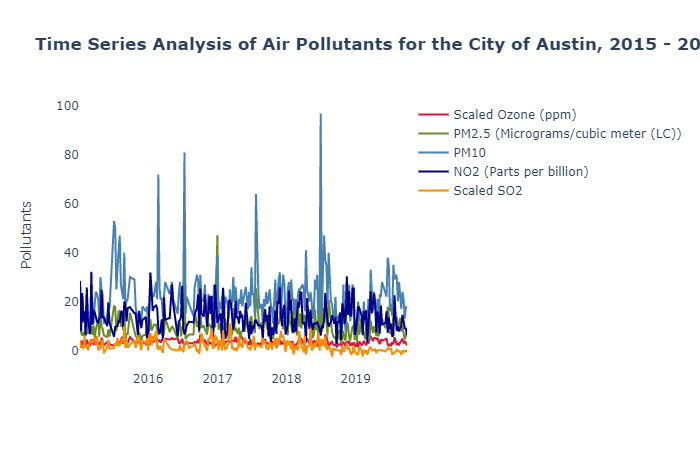

#  Austin Air Qaulity Analysis and Prediction
The scope of this project is limited to the city of Austin, Texas in USA.

##  Tools & Models Used
**Regression Models | Linear Regression | Lasso | Random Forest | Polynomial Regression | Feature Selection | Hypothesis Testing | Scikit Learn | Python3 | Pandas | Numpy | Plotly | Seaborn | Feature Scaling | API | Requests** 
 
## Data Sources
Five years of data has been used for this project from 2015 to 2019. Data has been collected using API from the following two sources:
1. epa.gov - air pollutants (Ozone, PM2.5, NO2, SO2)
2. worldweatheronline.com - weather parameters
 
## Findings & Conclusion 

**Nitrogen Dioxide (NO2) and Weather Co-relation Study for the City of Austin, Texas**   

Based on the nitrogen dioxide and weather data from 2015 to 2019, we can see that the weather conditions does impact nitrogen dioxide level specifically minimum temperature and wind speed.

Following inferences can be made from the regression model used:

*   A decrease in Min temperature, wind speed, cloud cover, humidity increases the nitrogen dioxide level.
*   A decrease in pressure decreases the nitrogen dioxide level.

Although based on the correlation matrix, the correlation between weather parameters and nitrogen dioxide doesn't seem to be very strong but based on the Null Hypothesis, we can conclude that weather parameters like Min Temperature, Wind Speed, Pressure and Cloud Cover does have an impact on nitrogen dioxide and we cannot ignore them. 

**Ozone (O3) and Weather Correlation Study for the City of Austin, Texas**   

Based on the ozone and weather data from 2015 to 2019, we can see that the weather conditions does impact ozone level specifically maximum temperature and humidity.

Following inferences can be made from the regression model used:
*   An increase in temperature increases the ozone level.
*   An increase in humidity decreases the ozone level.
*   An increase in cloudcover and wind speed also decreases the ozone level.

Although based on the correlation matrix, the correlation between weather parameters and ozone doesn't seem to be very strong but based on the Null Hypothesis, we can conclude that weather parameters like Max Temperature, Humidity, Wind Speed and Cloud Cover does have an impact on ozone and we cannot ignore them.
 
## From official EPA website:

Climate change can impact air quality and, conversely, air quality can impact climate change. 

Changes in climate can result in impacts to local air quality. Atmospheric warming associated with climate change has the potential to increase ground-level ozone in many regions, which may present challenges for compliance with the ozone standards in the future. The impact of climate change on other air pollutants, such as particulate matter, is less certain, but research is underway to address these uncertainties.

Emissions of pollutants into the air can result in changes to the climate. Ozone in the atmosphere warms the climate, while different components of particulate matter (PM) can have either warming or cooling effects on the climate. For example, black carbon, a particulate pollutant from combustion, contributes to the warming of the Earth, while particulate sulfates cool the earth's atmosphere.